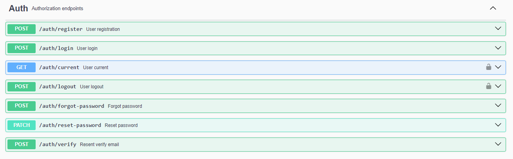
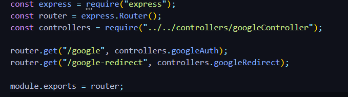
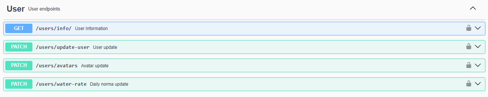
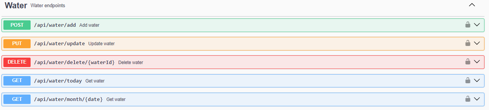

## Опис проєкту

Цей репозиторій містить бекенд частину додатку Agua Vivo, розробленого для [Agua Vivo App](https://serveribraimovua.github.io/agua_vivo_app/) (GitHub: [Frontend](https://github.com/ServerIbraimovUa/agua_vivo_app))

## Вимоги до середовища

| **Node.js** | **Express.js** | **dotenv** |
| **cors** | **MongoDB** | **Mongoose** |
| **SendGrid** | **Axios** | **bcrypt** |
| **cloudinary** | **gravatar** | **nanoid** |
| **Joi** | **Jsonwebtoken** | **Morgan** |
| **query-string** | **Multer** | **swagger-ui-express** |

## Інструкції з встановлення

1. Клонуйте репозиторій

````bash
git clone https://github.com/nightven/agua_vivo_app_backend.git

## Інструкції з встановлення

1. Клонуйте репозиторій

```bash
git clone https://github.com/nightven/agua_vivo_app_backend.git
````

2. Встановіть залежності

```bash
npm install
```

3. Додайте файл .env з необхідними змінними.
   Необхідні змінні можна побачити в файлі EXAMPLE.ENV

````
4. Запустіть сервер
```bash
npm run dev
````

## Інструкції з використання

На нашому бекенді передбачено 4 основних роута. Для того, щоб протестити роботу кожного роута, ви можете скористатися [документацією Swagger](https://agua-vivo-app-backend.onrender.com/api-docs/).

### 1. Auth

Маршрут, який відповідає за процес авторизації користувача. Його функціонал включає в себе:

- Реєстрацію
- Увійти в систему
- Оновлення інформації про користувача
- Вийти з облікового запису
- Підтвердження електронної пошти
- Можливість зміни пароля, якщо користувач його забув.
  

### 2. Google

Шлях, призначений для авторизації користувача за допомогою електронної пошти від Google. Цей роут не відображається у Swagger, оскільки його реалізація знаходиться на фронтенді, але він доступний у фронтендовій частині додатка.



### 3. Users

Маршрут, призначений для доступу до інформації про користувача. Тут ви можете:

- Змінювати аватарку
- Редагувати особисті дані
- Отримувати інформацію про користувача
- Вести запис про щоденний обсяг вживаної води (це стосується фронтенд-додатка Water Tracker).

  

### 4. Water

Відповідний маршрут для всіх операцій, пов'язаних з водою. Його функції включають:

- Додавання
- Видалення
- Оновлення інформації про воду
- Інформацію про щоденне та щомісячне споживання води.

  

# Розробники

| [](https://github.com/nightven) [](https://github.com/nightven) [](https://www.linkedin.com/in/vitaliybeyar/) | [](https://github.com/sofiialives) [](https://github.com/sofiialives) [](https://www.linkedin.com/in/sofiiakarpova/) | [](https://github.com/ServerIbraimovUa) [](https://github.com/ServerIbraimovUa) [](https://www.linkedin.com/in/serveribraimov/) |
| ---------------------------------------------------------------------------------------------------------------------------------------------------------------------------------------------------------------------------------------------------------------------------------------------- | ----------------------------------------------------------------------------------------------------------------------------------------------------------------------------------------------------------------------------------------------------------------------------------------------------- | ------------------------------------------------------------------------------------------------------------------------------------------------------------------------------------------------------------------------------------------------------------------------------------------------------------------ |
| **Беяр Віталій** - Роут Water, Swagger Documentation                                                                                                                                                                                                                                           | **Карпова Софія** - Роут Auth, User, Google                                                                                                                                                                                                                                                           | **Ібраімов Сервер** - Swagger Documentation                                                                                                                                                                                                                                                                        |
|                                                                                                                                                                                                                                                                                                |

## Внесок

Якщо ви хочете внести свій внесок у цей проєкт, будь ласка, дивіться файл [CONTRIBUTING.md](CONTRIBUTING.md) для отримання відомостей. 😊

## Ліцензія

Цей проєкт ліцензований під MIT Ліцензією - подробиці дивіться у файлі [LICENSE](LICENSE). 📄
